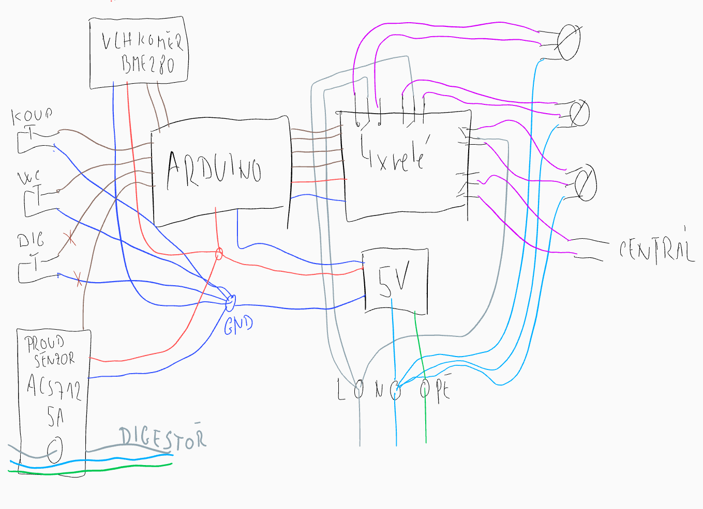
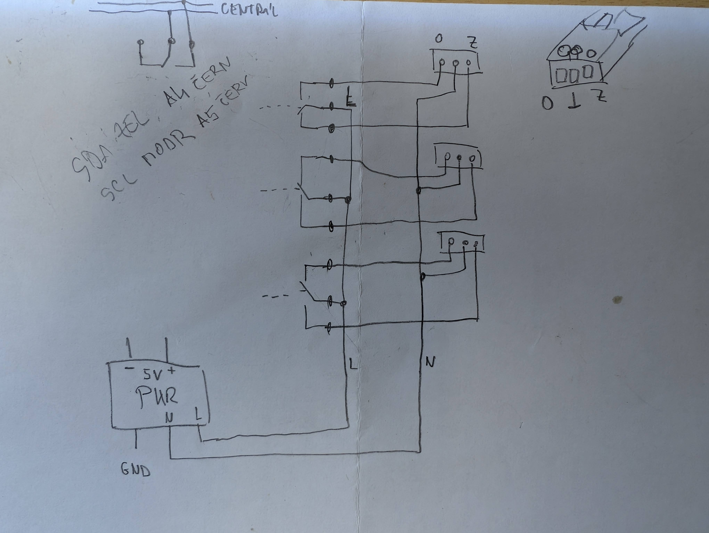

# Ventilation controller

System for controlling air exhaust in an apartment with a central exhaust fan on the roof. Exhaust is from the bathroom, toilet and kitchen. The system controls three electrically operated check valves. In the bathroom, ventilation can be switched on manually with a button or it is started automatically based on humidity. Exhaust from the toilet is started with a button. Exhaust from the kitchen is started when a current flowing into the hood is detected. When activated, the relevant flap opens and the central roof fan contact is closed. The relevant flap can be closed even before the ventilation time expires by holding down the button (3s).

## BOM

|Qty.|Item|Link|$|
|-|-|-|-|
|1|ACS712 5A Range Hall Current Sensor Module|https://www.aliexpress.com/item/1005008524523520.html|0.646|
|1|5V 4 channel relay module with optocoupler|https://www.aliexpress.com/item/32787386713.html|2.61|
|1|Switching Power Supply DC 5V 15W AC 100-240V|https://www.aliexpress.com/item/1005009319795034.html|3.71|
|1|BME280 5V Digital Sensor Temperature Barometric Atmospheric Pressure Module I2C|https://www.aliexpress.com/item/1005006087324764.html|3.31|
|3|PVC Plastic Electric Damper Check Valve AC220V, 110mm|https://www.aliexpress.com/item/1005007088174055.html|59.28|
|1|Arduino NANO Atmega 168 mini USB |https://www.aliexpress.com/item/1005007066680464.html|5.16|
|4|Wire quick connector|https://www.aliexpress.com/w/wholesale-wire-connector-quick.html|~3|
|1|Box 100x100x50 IP66|https://www.elima.cz/v/75785/s-box116-sk1001070100-krabice-instalacni-100x100x50-ip66-sez|3|
|x| cables |||
